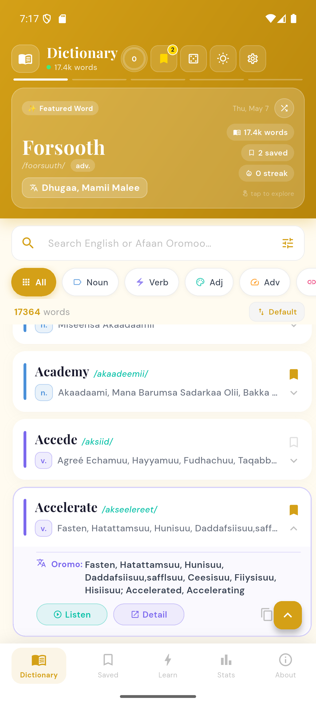
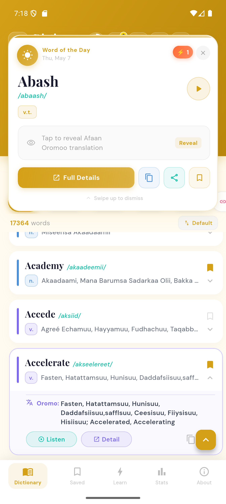
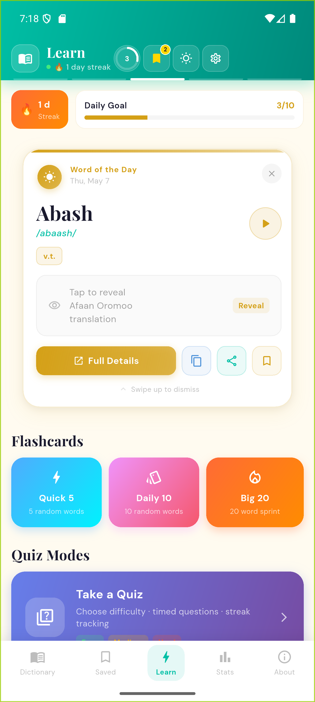
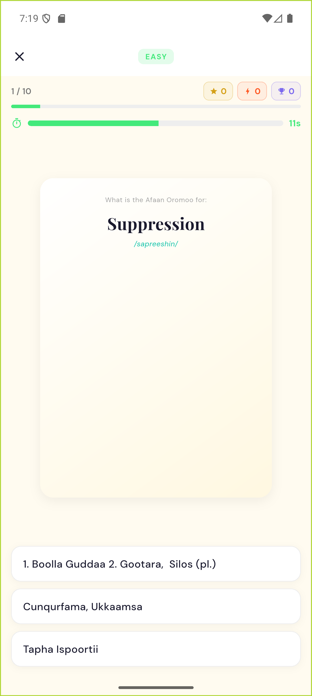
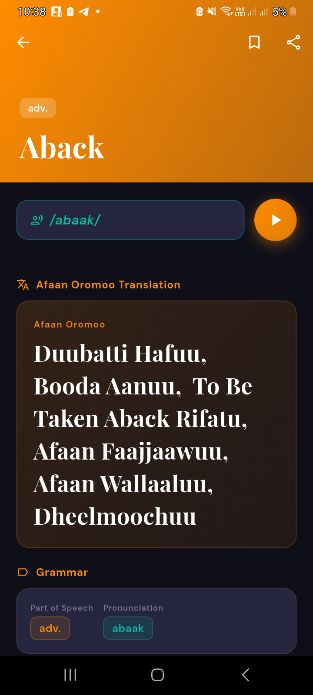
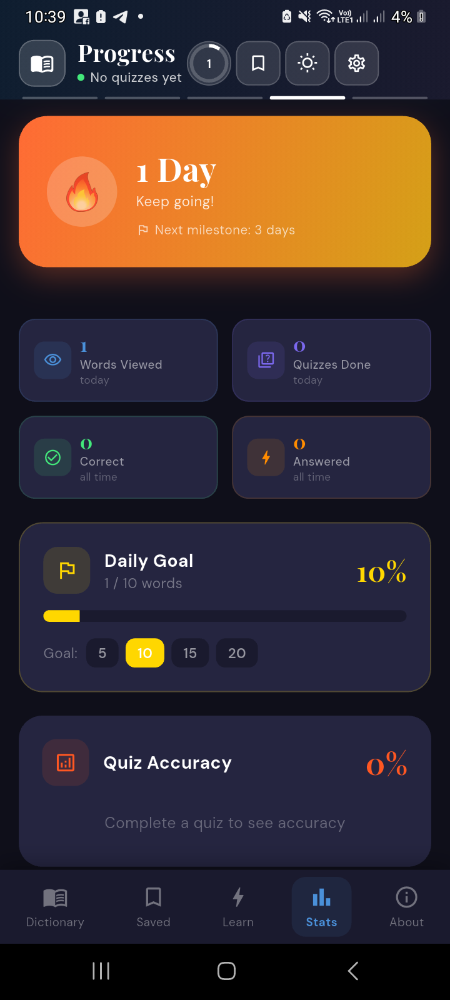

# Hamid Muudee's Dictionary

> A polished, offline-first **English ↔ Afaan Oromoo** dictionary and learning app built with Flutter.

[](https://flutter.dev)
[](https://dart.dev)
[](https://m3.material.io)
[](#dictionary-encryption)

Hamid Muudee's Dictionary is a modern Flutter application designed to make Afaan Oromoo vocabulary lookup, review, and practice simple, beautiful, and fast. The app bundles an encrypted local dictionary asset, supports bilingual search, includes learning tools such as flashcards and timed quizzes, and tracks user progress locally.
## Download

<a href="https://play.google.com/store/apps/details?id=com.horndevelopmentteam.oromo_dictionary">
  
</a>


## Table of Contents
- [Download](#download)
- [Highlights](#highlights)
- [Screenshots](#screenshots)
- [Feature Overview](#feature-overview)
- [Technology Stack](#technology-stack)
- [Project Structure](#project-structure)
- [Dictionary Encryption](#dictionary-encryption)
- [Getting Started](#getting-started)
- [Development Commands](#development-commands)
- [Building for Release](#building-for-release)
- [Configuration](#configuration)
- [Quality, Privacy, and Security Notes](#quality-privacy-and-security-notes)
- [Troubleshooting](#troubleshooting)
- [Credits](#credits)
- [License](#license)
## Highlights

- **Offline dictionary experience** using a bundled encrypted binary dictionary asset.
- **English ↔ Afaan Oromoo search** with part-of-speech filters, sorting, search history, and fast list navigation.
- **Beautiful word detail pages** with definitions, translations, pronunciation, grammar metadata, related words, copy, share, and bookmark actions.
- **Learning module** with Word of the Day, flashcards, and configurable timed quizzes.
- **Progress tracking** for daily goals, streaks, quiz accuracy, recently viewed words, and activity summaries.
- **Personalization** through light/dark appearance, font scaling, daily goal settings, and speech-rate control.
- **Cross-platform Flutter foundation** with Android, iOS, web, Windows, macOS, and Linux project targets included.


## Screenshots

The repository includes local app preview images in the project root. If you update the UI, replace these images to keep the README current.

| Dictionary | Word Detail / Learning | Quiz / Practice |
|---|---|---|
|  |  |  |

| Saved / Stats | Settings | Dark / Responsive UI |
|---|---|---|
|  |  |  |


## Feature Overview

### Dictionary

- Search by English word or Afaan Oromoo translation.
- Filter entries by normalized part of speech such as noun, verb, adjective, adverb, phrase, and more.
- Sort by alphabetical order, part of speech, or original dictionary order.
- A-Z sidebar navigation for faster browsing in alphabetical mode.
- Recent search suggestions stored locally.
- Long-press contextual actions for quick word interactions.

### Word Details

- English headword, pronunciation, part of speech, English definition, and Afaan Oromoo translation.
- Text-to-speech playback for English pronunciation using `flutter_tts`.
- Bookmark/favorite support with reactive UI updates across screens.
- Copy and share actions powered by clipboard and `share_plus`.
- Related words based on matching grammatical category.

### Learning

- Word of the Day notification-style card.
- Flashcard sessions:
  - **Quick 5** — 5 random words.
  - **Daily 10** — 10 random words.
  - **Big 20** — 20-word sprint.
- Flip-card animation for revealing Afaan Oromoo translations and definitions.
- Timed quiz modes with difficulty levels:
  - **Easy** — 20 seconds, 3 options.
  - **Medium** — 15 seconds, 4 options.
  - **Hard** — 10 seconds, 4 options.
- Quiz directions:
  - English → Afaan Oromoo.
  - Afaan Oromoo → English.

### Progress and Stats

- Daily word goal and progress indicator.
- Learning streak tracking.
- Words viewed today.
- Quizzes completed today.
- All-time correct answers and total quiz answers.
- Quiz accuracy visualization.
- Recently viewed word shortcuts.
- Weekly activity overview.

### Settings

- Light and dark appearance controls.
- Global font size scaling: small, medium, and large.
- Daily word goal adjustment.
- Text-to-speech speech-rate control with preview.
- Clear search history and recently viewed words.
- Reset learning progress.


## Technology Stack

| Area | Technology |
|---|---|
| Framework | Flutter |
| Language | Dart `^3.7.2` |
| UI | Material widgets, custom responsive layouts, Google Fonts |
| Local persistence | `shared_preferences` |
| App state | `AppSession` singleton, `ValueNotifier`, reactive rebuilds |
| Dictionary security | AES-CBC encrypted asset, SHA-256 derived key |
| Cryptography packages | `encrypt`, `crypto`, `pointycastle` |
| Text-to-speech | `flutter_tts` |
| Sharing | `share_plus` |
| Launcher icons | `flutter_launcher_icons` |
| Testing | `flutter_test` |
| Linting | `flutter_lints` |


## Project Structure

```text
oromo_dictionary/
├── android/                         # Android platform project
├── ios/                             # iOS platform project
├── linux/                           # Linux desktop project
├── macos/                           # macOS desktop project
├── web/                             # Web target
├── windows/                         # Windows desktop project
├── assets/
│   ├── data/
│   │   └── dictionary.bin           # Encrypted dictionary payload
│   └── icons/
│       └── ic_launcher.png          # Launcher icon source
├── lib/
│   ├── main.dart                    # App bootstrap and global text scaling
│   ├── models/
│   │   └── word.dart                # Dictionary entry model
│   ├── screens/
│   │   ├── home_screen.dart         # Main shell, tabs, responsive navigation
│   │   ├── dictionary_screen.dart   # Dictionary search and filtering
│   │   ├── word_detail_screen.dart  # Word details, TTS, share, copy, save
│   │   ├── favorites_screen.dart    # Saved words
│   │   ├── learn_screen.dart        # Learning dashboard
│   │   ├── flashcard_screen.dart    # Flashcard practice
│   │   ├── quiz_screen.dart         # Timed quiz flow
│   │   ├── stats_screen.dart        # Progress and analytics
│   │   ├── settings_screen.dart     # User preferences and data controls
│   │   └── about_screen.dart        # App, author, and team information
│   ├── services/
│   │   ├── app_session.dart         # Session state and persisted user data
│   │   ├── prefs_service.dart       # SharedPreferences wrapper
│   │   ├── share_service.dart       # Share/copy helpers
│   │   └── tts_service.dart         # Text-to-speech wrapper
│   ├── themes/
│   │   ├── app_theme.dart           # Light/dark themes
│   │   └── app_sizing.dart          # Responsive spacing and typography
│   └── widgets/                     # Reusable word and Word-of-Day widgets
├── test/                            # Flutter widget tests
├── flutter_launcher_icons.yaml      # Launcher icon generation config
├── pubspec.yaml                     # Dependencies, assets, and app version
└── README.md
```


## Dictionary Encryption

The app loads its dictionary from:

```text
assets/data/dictionary.bin
```

At runtime, the dictionary is decrypted before being parsed into `Word` objects.

Current loading strategy:

1. Read `assets/data/dictionary.bin` from the Flutter asset bundle.
2. Treat the first **16 bytes** as the AES initialization vector.
3. Treat the remaining bytes as AES-CBC encrypted ciphertext.
4. Derive the AES key with:

   ```dart
   sha256.convert(utf8.encode(DICT_PASSWORD)).bytes
   ```

5. Pass the password at build/run time using Dart defines:

   ```bash
   --dart-define=DICT_PASSWORD=your_dictionary_password
   ```

> **Important:** Do not hard-code or commit the real dictionary password. Use local environment variables or CI/CD secrets for release builds.

The decrypted dictionary JSON is expected to contain entries shaped like:

```json
{
  "english": "example",
  "pronunciation": "ɪɡˈzɑːmpəl",
  "part_of_speech": "noun",
  "english_definition": "A thing characteristic of its kind.",
  "oromo_translation": "fakkeenya"
}
```


## Getting Started

### Prerequisites

Install the following before running the project:

- [Flutter SDK](https://docs.flutter.dev/get-started/install) compatible with Dart `^3.7.2`.
- Android Studio or Visual Studio Code with Flutter tooling.
- Android SDK for Android builds.
- Xcode for iOS/macOS builds on macOS.
- A valid `DICT_PASSWORD` for decrypting `assets/data/dictionary.bin`.

Verify your Flutter installation:

```bash
flutter doctor
```

### Install Dependencies

```bash
flutter pub get
```

### Run the App

```bash
flutter run --dart-define=DICT_PASSWORD=your_dictionary_password
```

Run on a specific device:

```bash
flutter devices
flutter run -d <device-id> --dart-define=DICT_PASSWORD=your_dictionary_password
```

Run on web:

```bash
flutter run -d chrome --dart-define=DICT_PASSWORD=your_dictionary_password
```


## Development Commands

### Analyze Code

```bash
flutter analyze
```

### Run Tests

```bash
flutter test
```

### Format Code

```bash
dart format lib test
```

### Regenerate Launcher Icons

The launcher icon source is configured in `flutter_launcher_icons.yaml` and `pubspec.yaml`.

```bash
dart run flutter_launcher_icons
```


## Building for Release

Always provide `DICT_PASSWORD` when building release artifacts, otherwise the encrypted dictionary cannot be decrypted at runtime.

### Android APK

```bash
flutter build apk --release --dart-define=DICT_PASSWORD=your_dictionary_password
```

### Android App Bundle

```bash
flutter build appbundle --release --dart-define=DICT_PASSWORD=your_dictionary_password
```

### iOS

```bash
flutter build ios --release --dart-define=DICT_PASSWORD=your_dictionary_password
```

### Web

```bash
flutter build web --release --dart-define=DICT_PASSWORD=your_dictionary_password
```

### Windows

```bash
flutter build windows --release --dart-define=DICT_PASSWORD=your_dictionary_password
```

### macOS

```bash
flutter build macos --release --dart-define=DICT_PASSWORD=your_dictionary_password
```

### Linux

```bash
flutter build linux --release --dart-define=DICT_PASSWORD=your_dictionary_password
```


## Configuration

Important project configuration lives in `pubspec.yaml`:

```yaml
name: oromo_dictionary
description: "Hamid Muudee Dictionary"
version: 1.0.2+10
environment:
  sdk: ^3.7.2
flutter:
  uses-material-design: true
  assets:
    - assets/data/dictionary.bin
    - assets/icons/ic_launcher.png
```

Before publishing a new release:

1. Update `version` in `pubspec.yaml`.
2. Confirm `assets/data/dictionary.bin` is encrypted with the expected password.
3. Run `flutter analyze` and `flutter test`.
4. Build with `--dart-define=DICT_PASSWORD=...`.
5. Verify the app launches and the dictionary list is populated.


## Quality, Privacy, and Security Notes

### Offline-First Behavior

- The dictionary content is bundled as an app asset.
- Search, favorites, progress, and learning stats work without a custom backend.
- User data is stored locally through `SharedPreferences`.

### User Data Stored Locally

The app persists:

- Favorites/bookmarked words.
- Search history.
- Recently viewed words.
- Font size preference.
- Daily learning goal.
- Streak and quiz progress.

### Security Considerations

- The dictionary asset is encrypted, but client-side secrets can still be extracted from distributed apps by a determined attacker.
- Do not treat `--dart-define` as a perfect secret-management system for highly sensitive data.
- Keep the raw dictionary source outside public repositories unless it is intended for release.
- Prefer CI/CD secrets for production builds.

### Platform Considerations

- Text-to-speech availability depends on installed platform voices.
- Sharing behavior depends on the host OS share sheet.
- Desktop and web builds may require platform-specific validation before release.


## Troubleshooting

### The app opens but the dictionary is empty

Check the following:

- `DICT_PASSWORD` was provided with `--dart-define`.
- The password matches the one used to encrypt `assets/data/dictionary.bin`.
- `assets/data/dictionary.bin` is listed under `flutter.assets` in `pubspec.yaml`.
- You restarted the app after changing Dart defines; hot reload may not update compile-time environment constants.

### Text-to-speech does not play audio

- Confirm the device volume is enabled.
- Confirm an English voice is installed on the device.
- Test the speech-rate preview in **Settings → Voice & Speech**.

### Share action does not open a share sheet

The `ShareService` falls back to copying text to the clipboard if the platform share action fails.

### Build fails after changing assets

Run:

```bash
flutter clean
flutter pub get
```

Then rebuild with the required Dart define.


## Roadmap Ideas

- Add automated tests for dictionary decryption and filtering behavior.
- Add localization for app UI labels.
- Add import tooling for generating encrypted dictionary binaries from source JSON.
- Add richer analytics charts for weekly/monthly learning progress.
- Add pronunciation support for Afaan Oromoo where platform voices are available.


## Credits

- **Dictionary author:** Prof. Mahdi Hamid Muudeetiin
- **Application:** Hamid Muudee's Dictionary
- **Development team:** Horn Development Team
- **Language focus:** Afaan Oromoo and English


## License
This project is licensed under the MIT License for the source code.

The dictionary content, word database, definitions, translations, audio, and related linguistic materials are not automatically covered by the MIT License. These materials may be copyrighted by their original author(s) or owner(s) and are included only with permission or for authorized use.

See the [LICENSE](LICENSE) file for details.
### Content Rights

The dictionary dataset and linguistic content used in this application are protected separately from the source code. Reuse, redistribution, or commercial use of the dictionary data is not permitted without written permission from the rightful owner(s).
